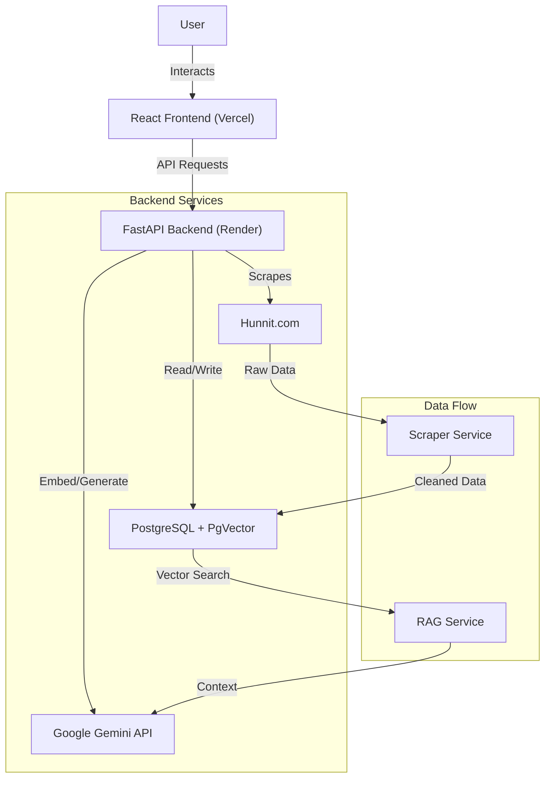
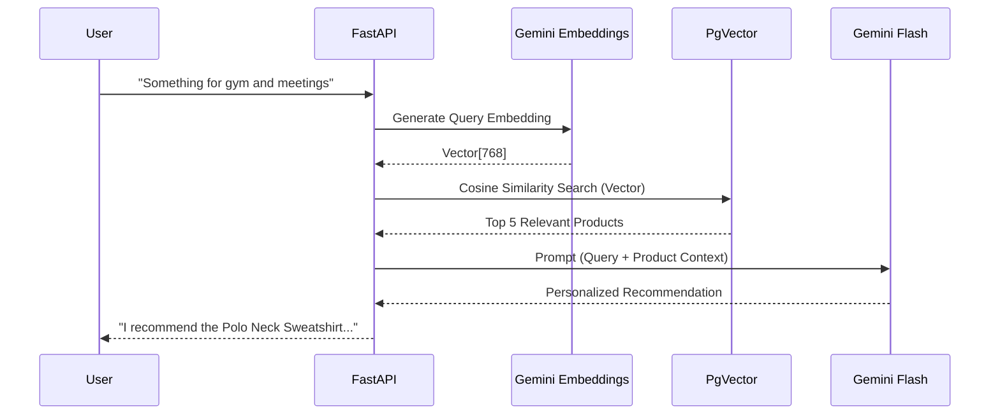

# VectorCart - AI-Powered Product Discovery Assistant

**VectorCart** is a production-ready, full-stack AI e-commerce assistant designed to bridge the gap between abstract user intent and concrete product discovery. It leverages **Retrieval Augmented Generation (RAG)** to understand nuanced queries (e.g., *"gym and office wear"*) and provide personalized, context-aware product recommendations.

## 🔗 Live Deployment

| Component | URL | Status |
|-----------|-----|--------|
| **Frontend Store** | [https://vector-cart-rho.vercel.app/](https://vector-cart-rho.vercel.app/) | 🟢 Live |
| **Backend API** | [https://vectorcart-api.onrender.com/docs](https://vectorcart-api.onrender.com/docs) | 🟢 Live |

---

## 🏗️ System Architecture

The system is built on a microservices-inspired architecture, containerized with Docker for consistency.

## 🧠 RAG Pipeline Design

The core of VectorCart is its RAG pipeline, which transforms vague user queries into precise product matches.

## 🚀 Key Features

*   **Automated Data Pipeline:** Custom scraper fetches, cleans, and normalizes product data from **Hunnit.com**, handling price parsing and HTML stripping.
*   **Semantic Search:** Uses **PgVector** to store high-dimensional embeddings (`models/text-embedding-004`), allowing for conceptual matching beyond simple keywords.
*   **Intelligent Reasoning:** **Gemini Flash** acts as a reasoning engine, explaining *why* a product fits the user's specific needs.
*   **Production-Grade Stack:** Fully Dockerized, typed (TypeScript/Pydantic), and deployed on scalable cloud infrastructure.

## 🛠️ Tech Stack

*   **Backend:** Python 3.11, FastAPI, SQLAlchemy, BeautifulSoup4
*   **Database:** PostgreSQL 16, PgVector Extension
*   **AI/ML:** Google Gemini API (`text-embedding-004`, `gemini-flash-latest`)
*   **Frontend:** React 18, TypeScript, Vite, TailwindCSS, Lucide Icons
*   **DevOps:** Docker, Docker Compose, Render, Vercel

## 🕷️ Scraping Strategy

*   **Target:** [Hunnit.com](https://hunnit.com)
*   **Methodology:** Instead of fragile DOM parsing, the scraper targets the Shopify `products.json` endpoint. This ensures:
    *   **Reliability:** Structure changes less frequently than HTML.
    *   **Speed:** No need to render JavaScript or load assets.
    *   **Cleanliness:** Structured JSON data requires minimal post-processing.

## ⚠️ Challenges & Trade-offs

1.  **Model Availability:** Initially targeted `gemini-pro`, but encountered deprecation/404 errors. **Solution:** Migrated to `gemini-flash-latest` for improved speed and reliability.
2.  **Context Window:** Limited retrieval to top 5 products to balance token usage and relevance. **Trade-off:** Extremely broad queries might miss niche products.
3.  **Deployment Cold Starts:** Render's free tier spins down inactive instances. **Mitigation:** Implemented efficient startup checks and lightweight Docker images.

## 🌟 Future Improvements (Bonus)

If given more time, I would implement:
1.  **Hybrid Search (Reciprocal Rank Fusion):** Combine BM25 (keyword) and Vector search to better handle exact SKU/name searches.
2.  **Multi-Modal Search:** Allow users to upload images to find visually similar products using Gemini Vision embeddings.
3.  **Conversational Memory:** Store chat history in Redis to support multi-turn dialogues (e.g., "Show me cheaper options").

---
*Built by Karthik for Neusearch AI Internship Assignment*
